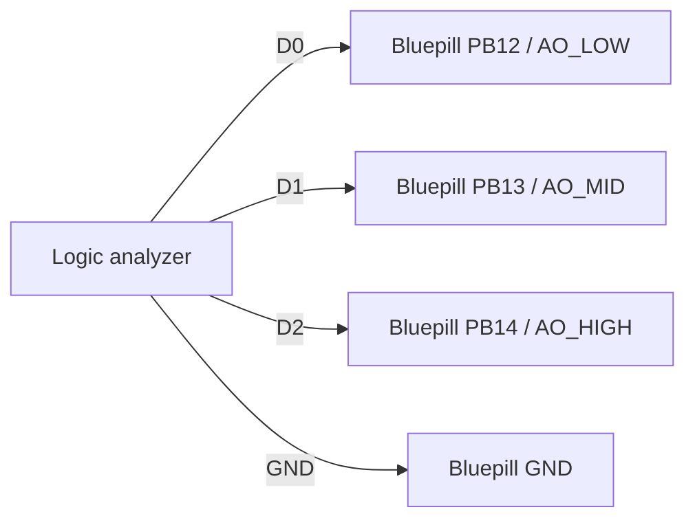

# ARM Cortex-M preemption example overview

This example demonstrates the bare-metal ARM Cortex-M port on the Bluepill target using a dummy application together with a remote logic analyzer capture.

The target application is a normal EDF executable. It instantiates three active objects subscribed to periodic events with different priorities and blocking execution times. Each active object drives one GPIO high on entry and low on exit. A real `SysTick_Handler()` drives EDF time events, and a second hardware timer provides the blocking execution delay used to keep each active object active long enough to observe preemption on the logic analyzer.

The target executable can be flashed through GDB using the existing remote hardware gateway flow described in [Embedded target remote debugging](../../../../../../doc/development_methodology/software_domain/resources/embedded_target_remote_debugging.md). The resulting GPIO trace can then be inspected with the remote Sigrok and PulseView workflow described in [Embedded target remote logic analyzer](../../../../../../doc/development_methodology/resources/embedded_target_remote_logic_analyzer.md) in order to validate the scheduling behavior visually.

## Use case

- `AO_LOW`: priority 2, first release at 10 ms, period 1000 ms, blocking time 500 ms.
- `AO_MID`: priority 3, first release at 20 ms, period 500 ms, blocking time 150 ms.
- `AO_HIGH`: priority 4, first release at 30 ms, period 100 ms, blocking time 10 ms.

The phase offsets are chosen to start almost immediately after `t0` while still guaranteeing observable nested preemption:
- `AO_MID` preempts `AO_LOW`.
- `AO_HIGH` preempts `AO_MID` while `AO_LOW` is still active.

The execution budgets counted by the dummy application are:
- `AO_LOW`: 500 ms of effective execution time
- `AO_MID`: 150 ms of effective execution time
- `AO_HIGH`: 10 ms of effective execution time

Over one aligned 1 second observation window, the effective execution-time totals are expected to be:
- `AO_LOW`: 500 ms
- `AO_MID`: 300 ms
- `AO_HIGH`: 100 ms
- `Idle`: 100 ms

This means the logic analyzer trace shows both:
- the effective execution budget consumed by each active object, counted only while it is actually running
- the preemption gaps inserted by higher-priority active objects, visible as extra active time on lower-priority pulses

## Wiring

Connect the logic analyzer as follows:

- `D0` -> `PB12` (`AO_LOW` trace)
- `D1` -> `PB13` (`AO_MID` trace)
- `D2` -> `PB14` (`AO_HIGH` trace)
- Logic analyzer `GND` -> Bluepill `GND`

## Expected logic-analyzer behavior

When observed in Sigrok/PulseView, this example should show:
- `D0` / `PB12` starting first and staying active for the longest pulse.
- `D1` / `PB13` preempting `D0` periodically.
- `D2` / `PB14` preempting `D1` and `D0` periodically.
- A visible nested sequence `AO_LOW -> AO_MID -> AO_HIGH`.
- A total effective execution-time budget of approximately 900 ms per aligned 1 s observation window, leaving roughly 100 ms idle.

## Glossary

| Term | Definition |
|---|---|
| Effective execution time | Time budget counted only while one AO is actually running, excluding the time it spends preempted. |

## Usage example

- Configure and build the example using any of the target STM32F103C8Tx CMake presets.
- Flash the resulting `arm_cortex_m_preemption_example` executable through the existing remote target workflow.
- Open the remote logic analyzer workflow and confirm that the waveforms match the expected nested-preemption pattern described above.
