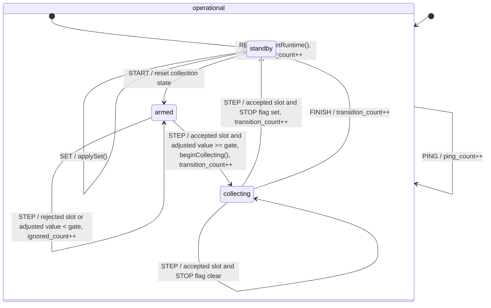

# Fuzz example overview

Tiny dummy application used to validate the host fuzzing port end-to-end. It provides a minimal HSM (Hierarchical State Machine), a small set of immutable and mutable events, reserved crash/hang paths and a [corpus](../../../../../fuzz/fuzz_example/corpus/) suitable for exercising the template fuzzing workflow. The implemented HSM is the following:

The purpose of this example is to teach the fuzzing flow and stateful discovery, not to model a real application domain.

# Glossary

| Term | Definition |
|---|---|
| HSM | Hierarchical State Machine implemented by an active object. |
| Corpus | Versioned initial input set used to bootstrap the fuzzing campaign. |

# Usage example

This example is built only under the following CMake configuration:
- `EDF_EXAMPLE_FUZZ=ON`
- `EBF_CORE=EBF_CORE_OS`
- `EBF_PORT=EBF_PORT_POSIX_NON_PREEMPTIVE_FUZZ`.
