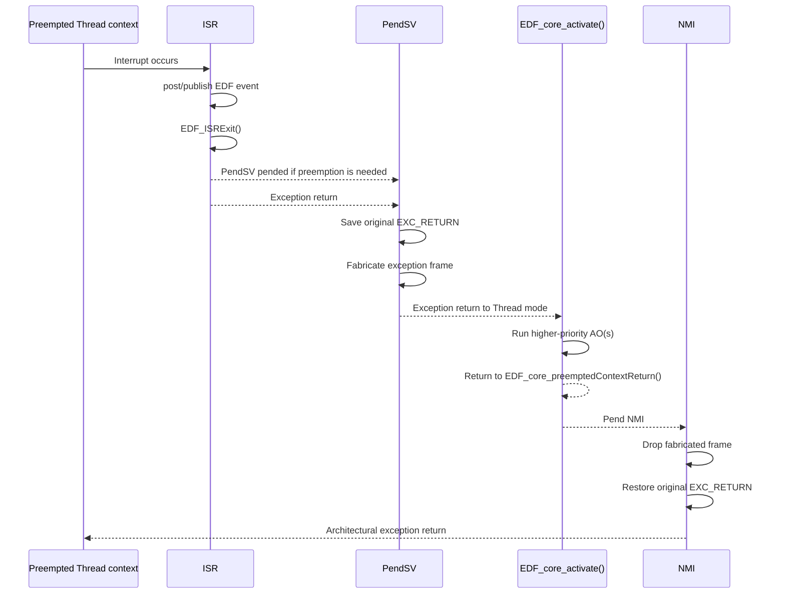
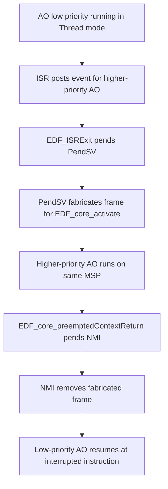

# ARM Cortex-M EDF core overview

This core provides the preemptive EDF kernel for bare-metal ARM Cortex-M targets. It does not allocate one stack per active object. Instead, all Thread-mode execution shares the MSP and preemption is implemented by temporarily rewriting the top of that single stack.

Any ISR that posts or publishes EDF events shall finish with `EDF_ISRExit()`. During initialization this core sets `PendSV` to the lowest priority and, when present, enables FPU lazy stacking.

# Glossary

| Term | Definition |
|------|------------|
| Single-stack preemption | Execution model where idle code and all active objects share the MSP instead of owning private stacks. |
| Fabricated exception frame | Artificial 8-word frame written by `PendSV_Handler` so hardware exception return starts `EDF_core_activate()` in Thread mode. |
| EXC_RETURN | Special value used in Handler mode to trigger architectural exception return to the previously interrupted context. |
| Preemption-threshold | Priority ceiling attached to one active object to limit which higher-priority objects may preempt it. |

# Context switch model

`EDF_activeObject_start()` ignores `stack_storage` and `stack_size` parameters in this core. The scheduler still supports real preemption, but it does so by keeping the interrupted Thread-mode context on the MSP and running the higher-priority activation on top of it.

The flow is:
1. An ISR posts or publishes an event and finishes with `EDF_ISRExit()`.
2. `EDF_ISRExit()` calls the scheduler inside a critical section.
3. If a higher-priority active object shall run, `EDF_ISRExit()` pends `PendSV`.
4. After the ISR finishes, `PendSV_Handler` saves the original return information, fabricates a new exception frame and exception-returns into `EDF_core_activate()`.
5. `EDF_core_activate()` runs in Thread mode on the same MSP and may dispatch one or more higher-priority active objects.
6. When the activation finishes, the function returns to `EDF_core_preemptedContextReturn()`,which pends `NMI`.
7. `NMI_Handler` removes the fabricated frame, restores the original `EXC_RETURN` and the CPU resumes the exact interrupted context.



# Fabricated stack frame

`PendSV_Handler` first pushes one scratch word together with the original `EXC_RETURN`, then reserves 8 words and fills only the slots that matter for a Thread-mode restart:

| Fabricated frame word | Written value | Purpose |
|-----------------------|---------------|---------|
| r0-r12 slots | Unused | Ignored by this activation path. |
| LR slot | `EDF_core_preemptedContextReturn()` | Return target when `EDF_core_activate()` finishes. |
| PC slot | `EDF_core_activate()` with bit 0 cleared | Entry point restored by exception return. |
| xPSR slot | `0x01000000` | Restores the Thumb state bit. |

After that setup, `PendSV_Handler` executes `BX 0xFFFFFFF9`, which performs an exception return to Thread mode using MSP. The fabricated frame is consumed by hardware exactly as if it had been stacked by a real exception.

```text
MSP after PendSV setup
lowest address
  [ fabricated exception frame for EDF_core_activate() ]
  [ saved scratch word ]
  [ saved original EXC_RETURN ]
  [ hardware-saved frame of the interrupted Thread context ]
  [ interrupted call chain and local variables ... ]
highest address
```

# Why `NMI` is used

When `EDF_core_activate()` returns, execution is back in Thread mode. At that point the core still needs one privileged exception context to:
- remove the fabricated frame,
- leave the EDF critical section,
- branch to the original saved `EXC_RETURN`.

`NMI` is used for that final step because it cannot be masked by `PRIMASK`. This makes it reliable even if the activation path reaches `EDF_core_preemptedContextReturn()` while the EDF critical section is still active.

`NMI_Handler` performs only three operations:
1. `ADD sp, sp, #(8*4)` removes the fabricated exception frame.
2. `EBF_exitCriticalSection()` clears the EBF critical-section state and re-enables interrupts.
3. `POP {r0, pc}` discards the scratch word and loads the saved original `EXC_RETURN` into `pc`.

That final branch causes the architectural exception return that resumes the context originally interrupted before `PendSV` ran.

# Single-stack preemption example

The important point is that the preempted active object remains on the MSP while the higher-priority one runs. The core does not swap stacks; it layers one activation path on top of another.



```text
While the higher-priority AO is running, the MSP contains:
lowest address
  [ current EDF_core_activate() / HSM call chain ]
  [ fabricated exception frame for this preemption ]
  [ saved scratch word ]
  [ saved original EXC_RETURN ]
  [ hardware-saved frame of the preempted AO ]
  [ preempted AO call chain and local variables ... ]
highest address
```

This means stack sizing for this core shall account for:
- the deepest application call chain that may be interrupted,
- one hardware exception frame per interrupt nesting level,
- one fabricated EDF frame plus saved `EXC_RETURN` per EDF preemption level,
- the call depth of `EDF_core_activate()` and the dispatched HSM handlers.

# FPU note

When the target provides an FPU, this core enables lazy stacking during initialization and clears `CONTROL.FPCA` before the final NMI-based return path. This avoids carrying an FP active context across the fabricated activation sequence.

# Usage example

For a complete on-target visual demonstration of nested preemption, see [`examples/arm_cortex_m_preemption_example`](../../../../../examples/arm_cortex_m_preemption_example/doc/arm_cortex_m_preemption_example.md).
