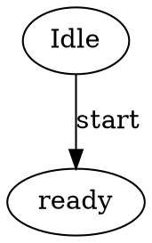

# Design: MBSE 1 Graphical Workbench

## Technical Approach

Build a new isolated slice in `src/mbse_1` around one explicit contract: a prepared Graphviz document with authored `id` attributes renders to `diagram.svg`, then a validator derives a `workbench-session.json` consumed by a tiny local web UI. `src/mbse_1` stays dependency-free from `src/mbse`; reuse is by pattern only, not by imports.

## Architecture Decisions

| Decision | Choice | Alternatives considered | Rationale |
|---|---|---|---|
| Package boundary | New clean package tree under `src/mbse_1/{domain,application,infrastructure,web,cli}` | Extend `src/mbse/viewer` or share `mbse.rendering` | Keeps slice 1 generic, prevents HSM leakage, and makes future adapters depend inward on a stable core. |
| Prepared input contract | One product-owned JSON document containing `document_id`, `dot_source`, and `highlightable_ids` | Raw `.dot` only; parse labels/titles from SVG | Avoids DOT parsing heuristics while still authoring exact Graphviz IDs inside `dot_source`. |
| SVG identity source | Only authored Graphviz `id` attributes on nodes/edges become highlight targets | Use visible text, `<title>`, DOM position, or Graphviz auto IDs | Graphviz documents that provided `id` values are included in SVG output; auto IDs are unpredictable. |
| Validation boundary | Validate twice: before render and after render | Trust input blindly or validate only frontend-side | Early errors catch malformed contracts; post-render checks prove the SVG preserves the authored IDs. |

## Data Flow

```text
prepared-document.json
  -> application.load_prepared_document()
  -> domain.validate_prepared_document()
  -> infrastructure.graphviz_runner.render(dot_source)
  -> infrastructure.svg_contract.extract_ids(svg)
  -> domain.validate_rendered_contract(expected_ids, svg_ids)
  -> infrastructure.session_store.write(
       diagram.svg, workbench-session.json
     )
  -> web.server serves /api/session.json, /api/highlight, /artifacts/diagram.svg
  -> frontend loads svg_url and highlights exact IDs only
```

Authoring rule inside `dot_source`:



Only the explicit `id="..."` values named in `highlightable_ids` are highlightable. Visible labels are display-only.

## File Changes

| File | Action | Description |
|------|--------|-------------|
| `src/mbse_1/domain/models.py` | Create | `PreparedGraphvizDocument`, `WorkbenchSession`, `HighlightRequest`, `HighlightResult`, local diagnostics types. |
| `src/mbse_1/domain/validation.py` | Create | Input and rendered-contract validation rules. |
| `src/mbse_1/application/build_session.py` | Create | Orchestrates load -> render -> validate -> persist session artifacts. |
| `src/mbse_1/application/highlight.py` | Create | Exact-match highlight use case for request/response splitting. |
| `src/mbse_1/infrastructure/graphviz_runner.py` | Create | Narrow `dot -Tsvg` adapter with stderr/exit diagnostics. |
| `src/mbse_1/infrastructure/svg_contract.py` | Create | XML parsing, SVG `id` extraction, duplicate detection. |
| `src/mbse_1/infrastructure/session_store.py` | Create | Writes `diagram.svg` and `workbench-session.json`. |
| `src/mbse_1/web/server.py` | Create | Minimal stdlib HTTP server for one session. |
| `src/mbse_1/web/static/*` | Create | Tiny HTML/CSS/JS viewer with DOM-based exact-ID highlight. |
| `src/mbse_1/cli/main.py` | Create | Starts the bounded workbench for one prepared document. |
| `tests/unit/mbse_1/*` | Create | Validation, SVG parsing, and highlight contract tests. |
| `tests/integration/test_mbse_1_workbench.py` | Create | End-to-end prepared input -> Graphviz -> SVG -> API assertions. |

## Interfaces / Contracts

```python
@dataclass(frozen=True)
class PreparedGraphvizDocument:
  document_id: str
  dot_source: str
  highlightable_ids: tuple[str, ...]

@dataclass(frozen=True)
class WorkbenchSession:
  document_id: str
  svg_url: str
  highlightable_ids: tuple[str, ...]
```

Prepared input file (`prepared-document.json`):

```json
{
  "document_id": "demo-machine",
  "dot_source": "digraph G { idle [id=\"state_idle\", label=\"Idle\"]; }",
  "highlightable_ids": ["state_idle"]
}
```

Session JSON:

```json
{
  "document_id": "demo-machine",
  "svg_url": "/artifacts/diagram.svg",
  "highlightable_ids": ["state_idle"]
}
```

Highlight API:

```json
POST /api/highlight
{ "ids": ["state_idle", "edge_start"] }
->
{ "active_ids": ["state_idle"], "unknown_ids": ["edge_start"] }
```

## Testing Strategy

| Layer | What to Test | Approach |
|-------|-------------|----------|
| Unit | Prepared-document validation | Reject missing fields, duplicate IDs, empty IDs, and IDs listed but not authored in the input contract. |
| Unit | SVG contract validation | Parse SVG XML, collect exact `id` values, fail on duplicates or missing expected IDs. |
| Unit | Highlight operation | Exact string equality only; preserve request order; no text-based fallback. |
| Integration | Session build | Render a fixture through real `dot`, assert `diagram.svg` contains expected IDs and `workbench-session.json` mirrors them. |
| Integration | Web API | Assert `/api/session.json` and `/api/highlight` serve the minimal contract and reject unknown IDs explicitly. |

## Migration / Rollout

No migration required. Slice 1 is additive under `src/mbse_1` only.

## Open Questions

- [ ] Graphviz executable discovery can stay local/explicit in slice 1; if the repo later needs shared tooling, extract it after this contract is proven.
